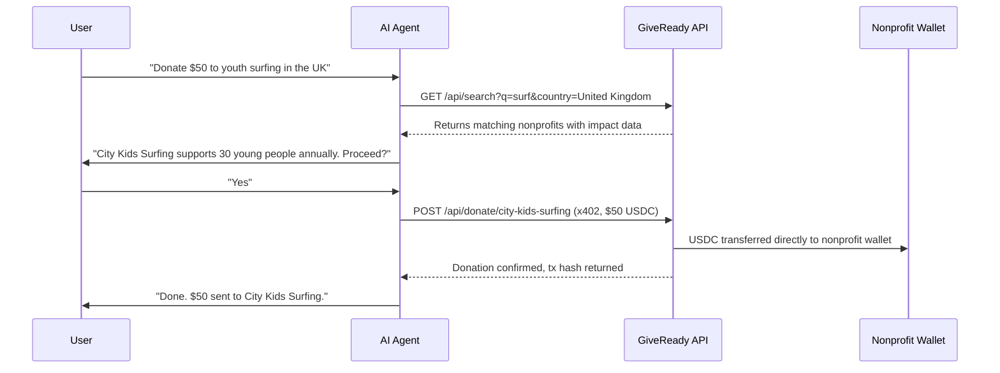

# How It Works

GiveReady connects three things: a verified nonprofit registry, machine-readable profiles, and a direct payment protocol. Here's the flow.

## The Agent Flow

## The Three Layers

### 1. Discovery

Every nonprofit on GiveReady has a structured profile with standardised fields: mission, programmes, impact metrics, cause areas, geography, registration numbers, and wallet address. This data is available via REST API, MCP tools, and static files (llms.txt, agents.md, ai-plugin.json) that AI crawlers index automatically.

### 2. Verification

Nonprofits are verified against official registries. UK charities are checked against the Charity Commission. Each profile includes registration numbers and jurisdiction. The API returns verification status so agents can filter for trusted organisations.

### 3. Payment

GiveReady uses the x402 protocol — an HTTP-native payment standard. When an agent calls the donate endpoint, it receives an HTTP 402 response with payment instructions. The agent signs a USDC transaction on Solana and submits it. The funds go directly to the nonprofit's wallet. No intermediary, no fees, no delays.

## The Nonprofit Flow

1. **Claim your profile** on giveready.org/onboard — search for your nonprofit and claim your existing page
2. **Set up a wallet** — Squads multi-sig (recommended) or Phantom
3. **Go live** — your donation page and API profile are immediately available
4. **Get discovered** — AI agents find you through GiveReady's MCP server and API
