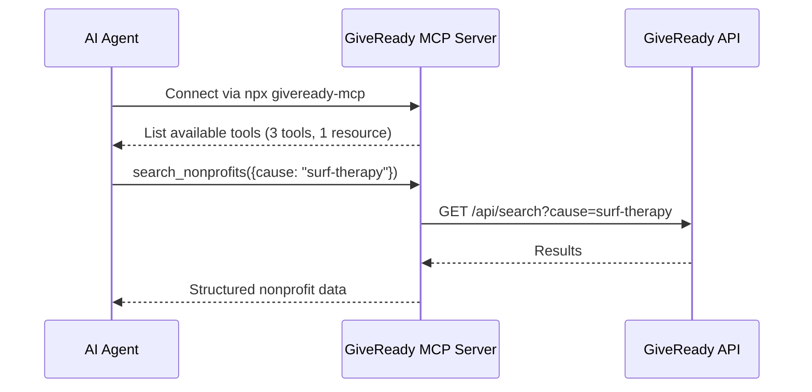

# MCP

MCP (Model Context Protocol) lets AI agents interact with GiveReady directly — searching nonprofits, reading profiles, and listing cause areas — all through a standardised tool-calling interface.

This means you can connect Claude, ChatGPT, Cursor, or any MCP-compatible client and discover verified nonprofits through natural language.

## How It Works

GiveReady exposes an MCP server that provides **3 tools** and **1 resource** to AI agents. The agent discovers these tools, understands their schemas, and calls them on your behalf.



## Installation

```bash
npx giveready-mcp
```

Or add to your MCP client configuration:

```json
{
  "mcpServers": {
    "giveready": {
      "command": "npx",
      "args": ["giveready-mcp"]
    }
  }
}
```

## Registry

GiveReady is registered on the MCP registry as:

```
io.github.gswardman/giveready
```

**npm package:** `giveready-mcp`
